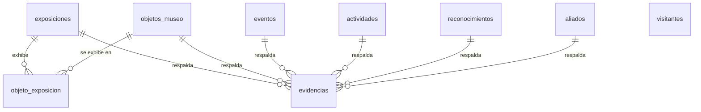

# 🏗️ app/infrastructure/

## 📖 Introducción

Adaptadores que implementan los puertos del dominio con tecnología concreta: SQLAlchemy 2 (async) sobre PostgreSQL.

## 🗂️ Archivos

| Archivo                             | Qué hace                                                                                            |
| ----------------------------------- | --------------------------------------------------------------------------------------------------- |
| `db/base.py`                        | `Base` declarativa con convención de nombres para constraints                                      |
| `db/database.py`                    | `Database`: motor async, `open_session()` para scripts, `session()` para FastAPI y `dispose()`      |
| `db/health.py`                      | `SqlAlchemyDatabaseProbe`, que implementa `DatabaseProbe`                                           |
| `db/models/columns.py`              | Piezas reutilizables: `ConIdentidadDeContenido`, `ConFechaParcial`, `columna_enum`, restricciones   |
| `db/models/*.py`                    | Un modelo ORM por tabla, cada uno con `a_dominio()`                                                 |
| `db/models/__init__.py`             | Registro de modelos (Alembic los descubre desde aquí)                                               |
| `repositories/base.py`              | `RepositorioSqlAlchemy[M, T, F]` genérico y `ConfiguracionLectura`                                   |
| `repositories/contenido.py`         | Configuración de cada colección: filtros, orden y precargas                                         |
| `repositories/galeria.py`           | `RepositorioGaleriaSqlAlchemy`: evidencias con sección y contexto calculados en SQL                 |
| `repositories/visitantes.py`        | `RepositorioVisitantesSqlAlchemy`, que implementa `RepositorioVisitantes`                           |

## 🗄️ Modelo de datos

Las 8 entidades que pide la guía (más la tabla puente `objeto_exposicion`):



| Tabla              | Campos clave                                                                                          |
| ------------------ | ----------------------------------------------------------------------------------------------------- |
| `exposiciones`     | slug, nombre, descripción, lugar, fecha parcial                                                       |
| `objetos_museo`    | slug, nombre, descripción, importancia, foto, modelo 3D, créditos, `pos_x/y/z`, `rot_y`, escala, orden |
| `eventos`          | slug, nombre, `tipo` (visita, evento, medios), fecha parcial, lugar, descripción                      |
| `actividades`      | slug, nombre, `tipo` (salida pedagógica, fecha conmemorativa, formación), fecha parcial, lugar        |
| `reconocimientos`  | slug, nombre, otorgante, fecha parcial, descripción                                                   |
| `aliados`          | slug, nombre, tipo, descripción, logo, sitio web                                                      |
| `evidencias`       | tipo (foto, video, audio, enlace, documento), url, título, créditos, orden y **una FK por padre**     |
| `visitantes`       | nombre, correo, institución, rol, mensaje, origen, `consentimiento_datos`                             |

## 🎯 Problema que resuelve

Aísla los detalles de persistencia: cambiar de driver, de motor o de consulta solo afecta a esta capa.

## 🔗 Dependencias

`sqlalchemy[asyncio]`, `asyncpg`, `app.domain`

## 🛠️ Cómo lo soluciona

- **Integridad en la base de datos, no solo en el código:**
  - `ck_evidencias_un_padre` (`num_nonnulls(...) <= 1`): una evidencia respalda a lo sumo un contenido. Se usan FKs reales en vez de una asociación polimórfica (`tipo` + `id`), que no tendría integridad referencial.
  - Los `CHECK` de fecha parcial replican las reglas de `FechaParcial`.
  - `ck_visitantes_consentimiento_obligatorio`: no se guarda un visitante sin autorización.
  - Los enums son `VARCHAR + CHECK`: agregar un valor después solo cambia el `CHECK` en una migración.
- **Un repositorio genérico** (`RepositorioSqlAlchemy`) para todo el contenido: cada colección solo declara su `ConfiguracionLectura` (OCP). Lista con filtros, cuenta el total, pagina y obtiene por slug.
- **Sin consultas N+1:** las relaciones son `lazy="raise"` y se cargan con `selectinload` declarado en la configuración. Si alguien olvida precargar, falla en las pruebas y no en producción.
- **Galería calculada en SQL:** la sección (`CASE`) y el contexto (`COALESCE` de los nombres de los padres) se calculan en la consulta, así se filtra, cuenta y pagina en PostgreSQL sin duplicar datos.
- **Índices** en cada FK de `evidencias` y en `(tipo, anio)` de eventos y actividades, que es como consultan las secciones del portal.

## 💡 Ejemplos de uso

```python
from app.infrastructure.repositories import contenido as configuraciones

async with database.open_session() as sesion:
    repositorio = RepositorioSqlAlchemy(sesion, configuraciones.EVENTOS)
    pagina = await repositorio.listar(FiltrosEventos(anio=2025), Paginacion())
    evento = await repositorio.obtener("festival-de-arte-de-kennedy")
```

Agregar una colección nueva: crear el modelo con `a_dominio()`, registrarlo en `db/models/__init__.py`, generar la migración y declarar su `ConfiguracionLectura` en `repositories/contenido.py`.
